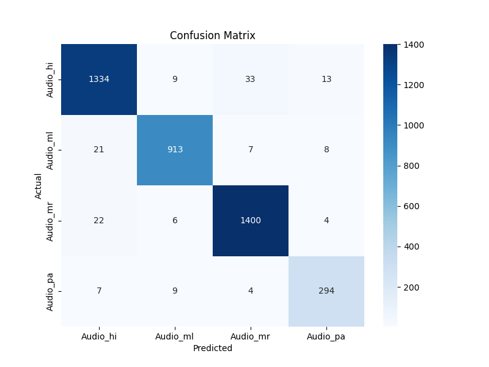
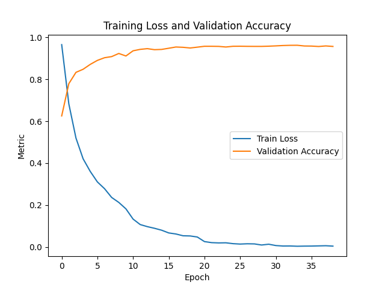

# 🎙️ Audio Language Detection (ALD)

This repository contains a deep learning-based Audio Language Detection (ALD) system developed from scratch using **PyTorch**. It identifies Indian languages from raw audio using a **1D CNN + BiLSTM** architecture.

The model is trained on **36k+ audio samples** in 4 Indian languages using data from **Mozilla Common Voice**.

---

## 🧠 Model Architecture

The model combines temporal and spectral learning using:

- 📉 **MFCC Features + Δ (delta) + ΔΔ (delta-delta)** coefficients
- 🧩 **1D Convolutional Layers**: Extract short-term temporal patterns
- 🔁 **Bidirectional LSTM Layers**: Learn long-range temporal dependencies
- 🧮 **Fully Connected Classifier**: Final softmax-based classification

> The model is trained with learning rate scheduling, early stopping, and stratified splits for robust generalization.

---

## 📊 Dataset

The model is trained on publicly available voice clips from the [Common Voice](https://commonvoice.mozilla.org) project.

| Language      | Label      | Samples  |
|---------------|------------|----------|
| Hindi         | `Audio_hi` | 9,400    |
| Malayalam     | `Audio_ml` | 9,500    |
| Marathi       | `Audio_mr` | 14,500   |
| Punjabi       | `Audio_pa` | 3,100    |

**Total Samples:** ~36,500

---

## 🌟 Key Features

✅ Trained from scratch on real-world multilingual audio  
✅ Dynamic MFCC + delta feature generation  
✅ Robust stratified train/val/test splitting  
✅ Integrated confusion matrix & classification report generation  
✅ Early stopping with patience monitoring  
✅ Learning rate decay scheduler  
✅ Clean, modular, and extensible PyTorch code  
✅ Easy to scale to more languages

---

## 📈 Results

- ✅ **Test Accuracy:** `96%`
- 🏆 **Macro F1 Score:** `0.96`

### 🔧 Classification Report


### 📊 Visualizations

#### Confusion Matrix



#### Training History



---

## 🚀 Use Cases

- 🗣️ **Multilingual Speech Assistants** – Auto-detect language for seamless communication  
- ☎️ **Call Center IVRs** – Route calls based on detected spoken language  
- 📊 **Language Analytics** – Understand regional audio usage  
- 🎧 **Media Tagging** – Auto-tag spoken language in voice clips  

---

## 🧪 Installation & Usage

### 🔧 Requirements
    ```bash
    torch>=1.7
    torchaudio>=0.7
    scikit-learn>=0.24
    numpy
    pandas
    matplotlib
    seaborn


### 📦 Setup

1. Clone the repository
   ```bash
   git clone https://github.com/<your-username>/audio-language-detection.git
   cd audio-language-detection
2. (Optional) Create virtual environment
   ```bash
   python -m venv venv
   source venv/bin/activate  # Windows: venv\Scripts\activate
3. Install Dependencies
   ```bash
   pip install -r requirements.txt
4. Prepare Dataset
   Expected folder structure:
             /path/to/audio/
          ├── Audio_hi/
          ├── Audio_ml/
          ├── Audio_mr/
          └── Audio_pa/
   Update base_path in ald.py accordingly.
5. Run Training
   ```bash
   python ald.py
   
## 📂 Files Overview
File	                              Description
ald.py	                              Main training & evaluation script
classification_report_new.txt	          Generated classification report
confusion_matrix_new.png	          Final test confusion matrix
training_history_new.png	          Training history plot
requirements.txt                    	Python dependencies
LICENSE	                              MIT License

## 🧠 Future Improvements
Add support for more languages (e.g., Tamil, Bengali, Gujarati)
Integrate real-time streaming inference
Deploy as a REST API with FastAPI or Flask
Convert model to TorchScript or ONNX for mobile inference

## 📄 License
This project is licensed under the MIT License.
## ✨ Acknowledgment
Special thanks to Digital India Bhashini
and Mozilla Common Voice for their support and datasets.


