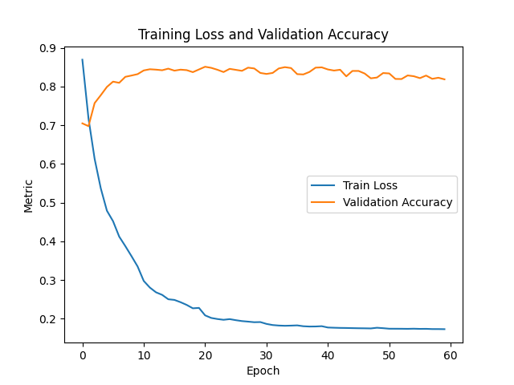
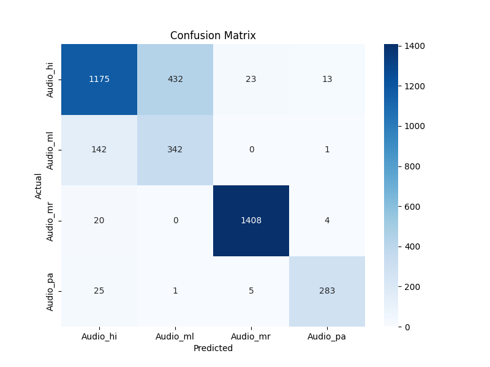

# AuLaD
# 🎙️ Automatic Language Detection (1D CNN + LSTM)

This project implements an automatic spoken language detection model using **1D Convolutional Neural Networks (CNNs)** followed by a **Bidirectional LSTM**. The system is trained on audio data in four Indian languages: **Hindi (hi)**, **Malayalam (ml)**, **Marathi (mr)**, and **Punjabi (pa)**. The goal is to classify a short audio clip into its corresponding language class.

---

## 🚀 Model Overview

The model architecture consists of:
- **MFCC extraction** along with delta and delta-delta features
- **1D CNN layers** for feature extraction
- **Bidirectional LSTM** for sequence modeling
- **Fully connected layers** for final classification

Training and evaluation are performed using PyTorch.

---

## 🧠 Model Architecture

- **Input:** 120-channel MFCC feature maps (MFCC + Δ + ΔΔ)
- **CNN Layers:** Conv1D → ReLU → MaxPool
- **LSTM:** 2-layer Bidirectional LSTM
- **Classifier:** Fully Connected (Linear + ReLU + Dropout) → Output Layer

---

## 📊 Performance

- **Test Accuracy:** 83%
- **Macro F1 Score:** 0.81

**Classification Report:**
          precision    recall  f1-score   support
Audio_hi       0.86      0.72      0.78      1643
Audio_ml       0.44      0.71      0.54       485
Audio_mr       0.98      0.98      0.98      1432
Audio_pa       0.94      0.90      0.92       314

Accuracy                            0.83      3874

##Macro avg 0.81 0.83 0.81
##Weighted avg 0.86 0.83 0.84
---

## 📉 Training History



---

## 🔍 Confusion Matrix



---

## 🧪 How to Run

### 1. Install dependencies:
```bash
pip install torch torchaudio scikit-learn matplotlib seaborn soundfile
---

## ⏱️ Inference Latency

Evaluation runtime over the test set: **~X seconds**

---

## 📌 Future Work

- Add support for more languages  
- Deploy to web or mobile  
- Integrate with ASR for full speech pipeline

---

## 📜 License

This project is licensed under the **MIT License**.
